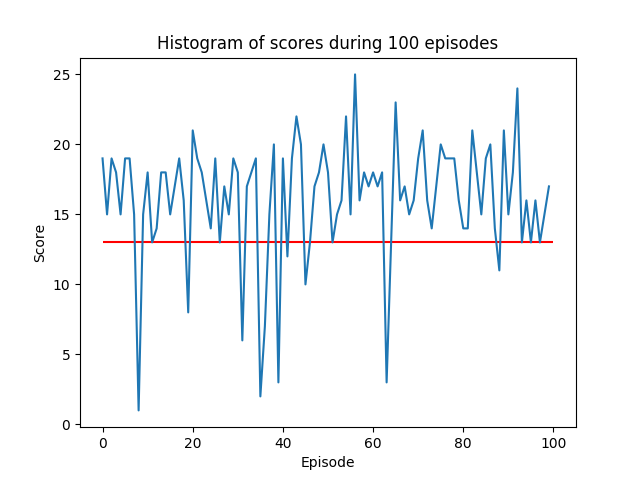
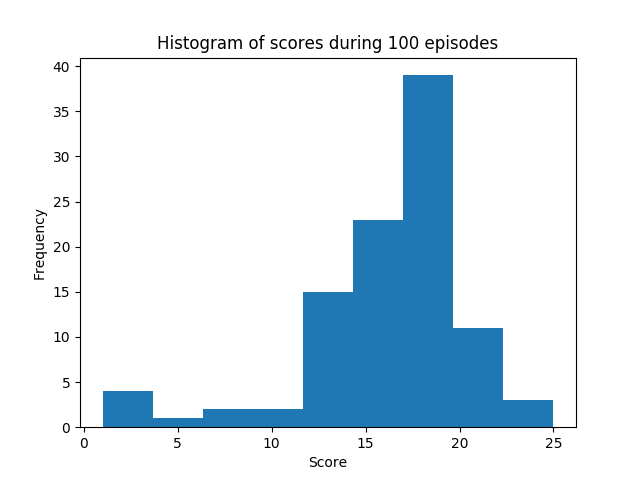

# Report
The scope of this report is to describe the learning algorithm, the hyperparameters and the performance of the agent used to solve the banana environment.
# Learning algorithm and model hyperparameters
The agent is a deep q-learning agent with double q-learning. The core idea of deep q-learning is to approximate the action value function by a deep neural net, a so-called q-network. To train the q-network, a mini batch of experience tuples is sampled randomly from a replay buffer. Each experience tuple consists of a state, an action, the resulting next state and the experienced reward. These experience tuples and estimations from the q-network can be used to calculate a TD error which serves as a loss function to optimize the q-network.

A fully-connected network or multi-layer perceptron was used to estimate the action value. The dimension of the first layer is 37, which is given by the dimension of the state vector. The number of possible actions sets the number of nodes of the final layer to 4. In between, multiple hidden layers are placed. Except for the final layer, all layers used a Relu activation-function. An informal search was carried out to find optimal dimensions of the hidden layers. For a fixed number of training episodes, it could be observed that the windowed average score increases to a maximum value before it declines again or oscillates due to overfitting. For the final network architecture, such a large maximum average value was traded off against a longer learning time resulting in choice of two hidden layers, each consisting of 64 nodes. To prevent overfitting, the training was stopped when the average score of the last 100 episodes was greater than *16.1*.
# Performance of the agent
In a test run consisting of 100 episodes, the agent achieved an average score of *16.15* (with a standard deviation of *4.3*) thus succesfully achieving the required performance. The following plots show the  reward per test episode and an histogram of all rewards:

# Outlook
The implementation of additional extensions and improvements to *vanilla* deep ql-learning such as dueling networks, multi-step learning, distributional RL and noisy nets as described in this [paper](https://arxiv.org/abs/1710.02298) could yield to further performance improvements. In addition, an early stopping mechanism similiar to the one used in regular training of deep neural networks can be incorporated into the *train_agent* function.
